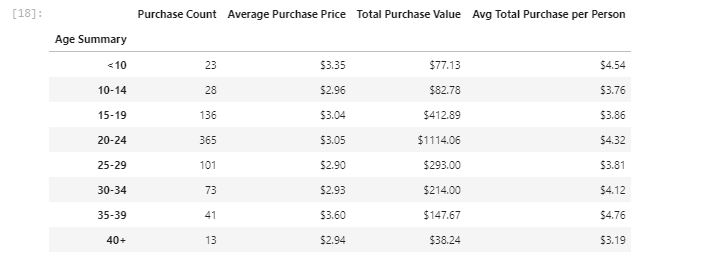
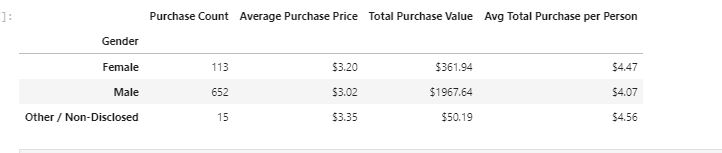
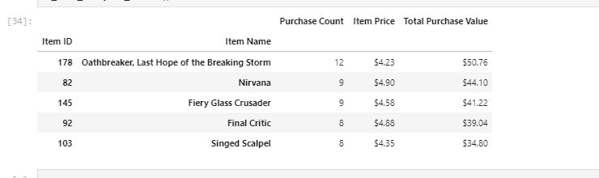

### Pandas-Challenge
Reads in excel file containing data around a new release video game-Heroes of Pymoli. Generates a report that breaks down the game's purchasing data into useful insights.

## How to Run Code

1. Clone repository to a folder on machine

2. Navigate to jupyter lab and open Heroes_of_Pymoli> Heroes of Pymoli.ipynb

3. Run all cells

### Tools/Libraries Used
Pandas, numpy, data munging

The final report included the following metrics:

### Player Count

* Total Number of Players

### Purchasing Analysis (Total)

* Number of Unique Items
* Average Purchase Price
* Total Number of Purchases
* Total Revenue

### Gender Demographics

* Percentage and Count of Male Players
* Percentage and Count of Female Players
* Percentage and Count of Other / Non-Disclosed

### Purchasing Analysis (Gender)

* The below each broken by gender
  * Purchase Count
  * Average Purchase Price
  * Total Purchase Value
  * Average Purchase Total per Person by Gender

### Age Demographics

* The below each broken into bins of 4 years (i.e. &lt;10, 10-14, 15-19, etc.)
  * Purchase Count
  * Average Purchase Price
  * Total Purchase Value
  * Average Purchase Total per Person by Age Group

### Top Spenders

* Identify the the top 5 spenders in the game by total purchase value, then list (in a table):
  * SN
  * Purchase Count
  * Average Purchase Price
  * Total Purchase Value

### Most Popular Items

* Identify the 5 most popular items by purchase count, then list (in a table):
  * Item ID
  * Item Name
  * Purchase Count
  * Item Price
  * Total Purchase Value

### Most Profitable Items

* Identify the 5 most profitable items by total purchase value, then list (in a table):
  * Item ID
  * Item Name
  * Purchase Count
  * Item Price
  * Total Purchase Value

# Screenshots

Puts purchasers into age group bins and reports on number of purchases, average purchase price, total purchase value, and avg total purchase per person by bin.

Splits purchasers up by Gender and reports on number of purchases, average purchase price,and avg total purchase per person by gender.

Identifies the 5 most popular items and reports on number of purchases, item price, and total purchase value.

